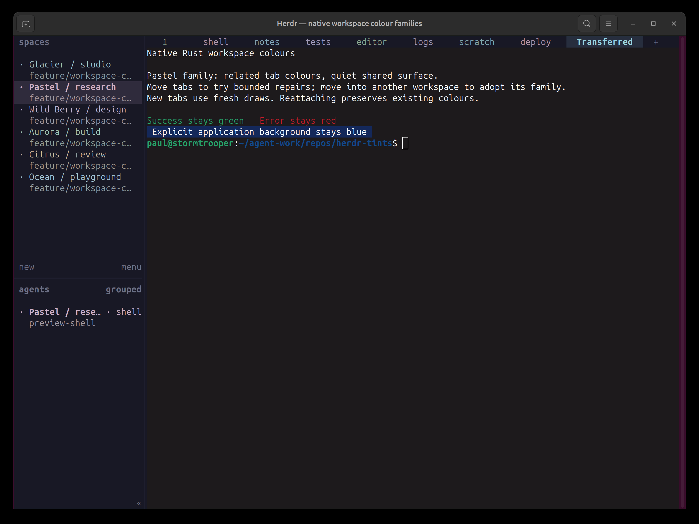

# Herdr with workspace colour families

This experimental fork contains two changes on top of upstream Herdr 0.9.1:

1. **Optional workspace colour families.** Distinct workspace identities, related but varied tab colours, matching agent labels, and barely tinted terminal surfaces. Neutral backgrounds, muted inactive labels and restrained selection styling keep the interface quiet.
2. **Default-colour redraw correction.** OSC 10/11 colour changes and OSC 110/111 resets refresh untouched cells, including blank rows. This fix applies independently of workspace colours.

This is an unofficial fork, not an upstream release. Both changes are included on `feature/workspace-colour-families`.

## See it

[Watch the 24-second navigation recording](docs/next/media/workspace-colours/navigation.mp4)



[Ocean screenshot](docs/next/media/workspace-colours/04-ocean.png) · [Glacier with overflowing tabs](docs/next/media/workspace-colours/07-glacier-overflow.png)

The recording captures the real application, navigated through Herdr's CLI. It shows tab changes, workspace changes and native overflow; it is not a latency benchmark.

## Try it

Build the fork with Herdr's existing prerequisites (Rust 1.96.1, Zig 0.16.0 and `just`):

```sh
git clone --branch feature/workspace-colour-families https://github.com/pauljones0/herdr.git
cd herdr
just build
```

Add this setting to your Herdr configuration:

```toml
[theme]
workspace_colours = true
```

Run `./target/release/herdr` from this checkout. To isolate evaluation from an existing session, use a new session name and clear inherited socket overrides:

```sh
env -u HERDR_SOCKET_PATH -u HERDR_CLIENT_SOCKET_PATH ./target/release/herdr --session colours-preview
```

The colour option defaults off; disabling it restores ordinary styling. The OSC redraw fix is always active. This fork does not change the upstream update channel; upstream updates do not include these custom changes.

## Design

The 24 named art directions have curated hue and tonal rules; actual workspace and tab colours are generated variations. No fixed seed is required. Workspace families stay coherent as tabs are added. Moves preserve colours when possible, with bounded local repairs; transfers adopt the destination family. Reattachment on the same computer preserves assignments.

Agent entries follow their owning tab. Terminal background tints are contrast-checked and very slight, preserving semantic ANSI colours and explicit application backgrounds. Labels remain the primary identifiers; colour is an extra cue, not a guarantee of accessibility or unlimited distinguishability.

The implementation is native Rust client presentation with no new Cargo dependencies or wire fields. Rendering uses cached RGB values; generation happens on topology changes. Checkpoint writes run in the background.

See [the full behaviour and limitations](docs/next/website/src/content/docs/workspace-colours.mdx), including OSC-query semantics and client-local persistence.

## Validation

On Linux, `just ci` passed all 3,773 tests (10 skipped), lint, maintenance checks, UI architecture checks and integration asset tests. Documentation contract checks passed separately. All seven render-scale profiles passed after the final styling changes.

Populated render medians were 319 µs off / 335 µs on for one pane and 413 µs off / 401 µs on for 15 panes. Differences include measurement noise; no speedup is claimed. Earlier allocation samples were roughly 1–2 ms for ordinary additions, with a difficult repair around 20 ms. These are measurements, not real-time guarantees.

Visual checks used GNOME Terminal on Linux. Automated contrast checks cover dark and light palettes. Windows SDK cross-compilation and live macOS/Windows verification have not been performed for this fork.

## Upstream

Herdr's [contribution policy](https://github.com/herdrdev/herdr/blob/master/CONTRIBUTING.md) directs feature proposals to Discussions and limits implementation PRs to approved contributors. This fork is for experimentation and sharing; it does not represent an accepted upstream feature.
